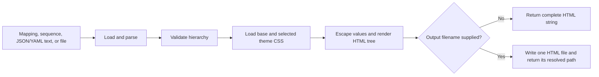
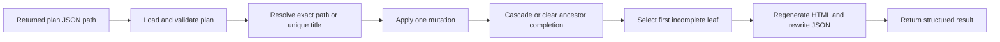

# Hierarchical HTML and Plan API

`render_hierarchy_html` turns a mapping or sequence into a responsive, self-contained HTML tree.
`create_hierarchy_plan` and `update_hierarchy_plan` add durable, agent-managed plan state. These
functions are direct Python APIs and MCP tools. They are not CLI commands.

The function produces a standalone document. The document embeds its CSS and JavaScript. It
escapes source labels and values and preserves source order. The function can return the complete
document as a string or write it as one UTF-8 HTML file.

## Quick start

```python
from mcp_agent_ops.hierarchy import render_hierarchy_html

plan = {
    "Delivery": {
        "phases": [
            {"title": "Discovery", "status": "complete"},
            {"title": "Implementation", "status": "in_progress"},
        ]
    }
}

html = render_hierarchy_html(
    plan,
    title="Delivery plan",
    theme="outline",
    numbering=True,
    checkboxes=True,
)
```

`html` contains the complete document. To save it instead:

```python
from pathlib import Path

saved_path = render_hierarchy_html(
    Path("plans/delivery.yaml"),
    title="Delivery plan",
    numbering=True,
    output_filename="delivery-plan.html",
    output_folder="reports",
)
```

The destination folder is created when needed, and `saved_path` is the resolved `Path` to the
written file.

## MCP tools

The MCP server publishes the three hierarchy functions under their Python names.

| Tool | Required arguments | Result |
|---|---|---|
| `render_hierarchy_html` | `source` | Complete HTML, or the resolved HTML path when a destination is available. |
| `create_hierarchy_plan` | `source`, `output_filename` | Canonical JSON, or its resolved path when a destination is available. |
| `update_hierarchy_plan` | `plan_path`, `target`, and exactly one mutation argument | Structured success, plan path, completed ancestors, and next executable task. |

MCP calls can supply an inline mapping, sequence, JSON string, or YAML string as `source`. A source
file path, custom `themes_folder`, `output_folder`, or `plan_path` must be absolute. Each path must
resolve beneath `MCP_AGENT_OPS_WORKSPACE_ROOTS` or the conventional Codex
`~/.codex/visualizations` subtree. The Codex location is authorized only for hierarchy operations.
If a write call omits `output_folder`, the server uses `MCP_AGENT_OPS_HIERARCHY_OUTPUT_FOLDER` when
configured. Without either destination, rendering returns inline HTML and plan creation returns
canonical JSON without writing files.

The following arguments create a durable plan:

```json
{
  "source": {"Delivery plan": ["Discover", "Implement", "Release"]},
  "title": "Delivery plan",
  "output_filename": "delivery-plan.html",
  "output_folder": "/workspace/project/reports"
}
```

Pass the returned JSON path to `update_hierarchy_plan`:

```json
{
  "plan_path": "/workspace/project/reports/delivery-plan.json",
  "target": "2",
  "add_child": "Write focused tests"
}
```

Completing a task returns a structured result. A nested next task includes its parent context:

```json
{
  "success": true,
  "plan_path": "/workspace/project/reports/delivery-plan.json",
  "automatically_completed": [
    {"identifier": "1", "label": "First group"}
  ],
  "next_task": {
    "identifier": "2.1",
    "label": "First of second",
    "parents": [
      {"identifier": "2", "label": "Second group"}
    ]
  }
}
```

## Rendering flow



## Public API

### `render_hierarchy_html`

```python
render_hierarchy_html(
    source,
    *,
    title="Hierarchy",
    theme="default",
    themes_folder=None,
    numbering=False,
    checkboxes=False,
    completed_items=(),
    output_filename=None,
    output_folder=None,
)
```

| Parameter | Accepted value | Behavior |
| --- | --- | --- |
| `source` | Mapping, non-string sequence, JSON/YAML text, existing filename string, or `Path` | Supplies the hierarchy. The root must be a mapping or sequence. |
| `title` | `str` | Sets both the browser title and visible page heading. It is HTML-escaped. Default: `Hierarchy`. |
| `theme` | Simple base name | Selects `<theme>.css`. Packaged choices are `default`, `outline`, and `midnight`. Default: `default`. |
| `themes_folder` | `str`, `Path`, or `None` | Selects a caller-owned theme folder. Packaged themes are used when omitted. |
| `numbering` | `bool` | Adds one-based dotted numbers such as `1`, `1.2`, and `1.2.1`. A singleton branch root is an unnumbered wrapper. Default: `False`. |
| `checkboxes` | `bool` | Adds a static marker to each trackable node. A transparent singleton wrapper is not trackable. Default: `False`. |
| `completed_items` | Sequence of dotted paths | Selects exact markers that render complete. Requires `checkboxes=True`. Default: empty. |
| `output_filename` | Base filename or `None` | Writes the document when supplied. A directory component is not accepted. |
| `output_folder` | `str`, `Path`, or `None` | Selects or creates the destination folder. Requires `output_filename` and defaults to the current directory. |

The return type depends on `output_filename`:

- Without `output_filename`, the function returns the complete HTML as `str`.
- With `output_filename`, it writes the file and returns its resolved `Path`.

An existing regular output file with the same name is replaced. A symbolic-link output target is
rejected. Use an `.html` filename so browsers and file tools recognize the result correctly.

## Supported hierarchy data

The root must be a mapping or a non-string sequence. Nested values may contain:

- mappings with scalar keys;
- non-string sequences;
- strings, integers, floating-point numbers, booleans, dates, datetimes, or `None`.

Mapping and sequence order are preserved. Values are displayed using JSON-like conventions:
booleans become `true` or `false`, `None` becomes `null`, and dates use ISO formatting.

### In-memory data

```python
render_hierarchy_html(
    {
        "release": {
            "owner": "Delivery",
            "tasks": ["Test", "Publish"],
        }
    }
)
```

### Full JSON or YAML content

```python
render_hierarchy_html('{"release": {"tasks": ["Test", "Publish"]}}')

render_hierarchy_html(
    """release:
  tasks:
    - Test
    - Publish
"""
)
```

Content without an explicit file suffix is attempted as JSON first, then YAML.

### Existing JSON or YAML files

```python
from pathlib import Path

render_hierarchy_html(Path("release.yaml"))
render_hierarchy_html("release.json")  # recognized as a file when it exists
```

Source files must use `.json`, `.yaml`, or `.yml`. Prefer `Path` when a value is intended to be a
filename: a missing `Path` produces a direct `FileNotFoundError`, while a non-existing string is
treated as document content.

## Tree controls

Every generated document begins fully expanded. One compact control row shows the level presets,
then the copy, expand-all, and collapse-all actions. The action buttons match the level-button size.
Copy uses the familiar overlapping-pages icon. Expand all uses a plus, and collapse all uses a
minus. Each icon button has an accessible name and a matching browser tooltip.

### Branch and global controls

- Selecting a branch row expands or collapses that branch.
- **Copy content** copies the complete hierarchy as indented plain text.
- **Expand all** opens every branch.
- **Collapse all** leaves the top-level rows visible and hides all child groups.

**Copy content** includes hidden descendants when branches are collapsed. It excludes the document
title and controls. Numbered labels contain a real text-space delimiter, so manual selection and
copying also produces text such as `1 Purpose and audience`. Completion markers become `[x]` and
`[ ]` in the copied text.

After a successful copy, the copy icon briefly uses the theme accent and its accessible name becomes
**Copied**. An assistive status message reports the same result. If browser clipboard access is
unavailable, the document uses a local copy fallback.

### Progressive level controls

The `1`, `2`, `3`, and `All` buttons reveal the numbered hierarchy a layer at a time:

| Control | Visible result |
| --- | --- |
| `1` | The first numbered level. Any transparent singleton wrapper remains visible and open. |
| `2` | The first two numbered levels. |
| `3` | The first three numbered levels. |
| `All` | Every level. |

**Expand all** selects the same state as `All`; **Collapse all** selects the same state as `1`.
Manually toggling an individual branch clears the active level indicator because the tree no longer
matches a global preset. Trees deeper than level 3 remain accessible through `All` and individual
branch controls.

The numeric controls use displayed numbering depth. An unnumbered singleton wrapper has depth `0`,
so level `1` opens that wrapper and displays its children as the first numbered level.

The generated controls include accessibility metadata:

- Branch buttons expose `aria-expanded` and `aria-controls`.
- The hierarchy uses tree, treeitem, and group roles.
- Level presets expose `aria-pressed` so assistive technology can identify the current state.
- Copy results use a polite live status message.

## Numbering

With `numbering=False`, mapping nodes use their keys and sequence entries use zero-based synthetic
labels such as `[0]`. With `numbering=True`, trackable nodes receive one-based dotted paths:

```text
1
1.1
1.1.1
1.1.2
1.2
```

When the root mapping contains one item and that item's value is another mapping or sequence, the
renderer treats the first item as a structural wrapper:

- The wrapper label remains visible.
- The wrapper has no number or completion marker.
- The wrapper's children begin at `1`, `2`, and so on.

For example, a `Delivery plan` wrapper can contain `1 Objective`, `2 Owner`, and `5 Milestones`.
Nested milestone items continue as `5.1`, `5.2`, and `5.3`.

Sequence labels such as `[0]` are omitted in numbered output. Mapping keys remain visible beside
their numbers. A numbered sequence entry that contains one mapping item uses that mapping key at
the sequence entry's current path. It does not add a blank synthetic level.

## Read-only completion markers

`checkboxes=True` places a static visual marker before each trackable node. An unnumbered singleton
wrapper is structural and does not receive a marker. Each marker is intentionally read-only:

- its initial state comes from `completed_items` or a durable plan source;
- it is not a form control and cannot receive focus or be toggled;
- it has no save, storage, or source-update handler;
- it does not modify JSON, YAML, Python data, or the generated HTML file.

`completed_items` uses complete one-based dotted paths. For example, `1.6.1` does not select
`1.6.10` or `1.6.1.1`. Direct rendering does not persist marker state. Use the durable plan API
when an agent must update state after creation.

## Durable plan creation and mutation

`create_hierarchy_plan` creates a canonical JSON plan and a same-named HTML report. It returns the
resolved JSON path. That path is the stable parameter for every later mutation.

```python
from mcp_agent_ops.hierarchy import create_hierarchy_plan, update_hierarchy_plan

plan_path = create_hierarchy_plan(
    {
        "Delivery plan": {
            "Discovery": ["Interview users", "Approve scope"],
            "Implementation": ["Build feature", "Write tests"],
        }
    },
    title="Delivery plan",
    theme="default",
    output_filename="delivery-plan.html",
    output_folder="reports",
    completed_items=("1.1",),
)

update_hierarchy_plan(plan_path, "2.1", text="Build approved feature")
update_hierarchy_plan(plan_path, "Build approved feature", completed=True)
```

The creation call above writes these files:

```text
reports/
├── delivery-plan.json    # Authoritative mutable plan source
└── delivery-plan.html    # Derived read-only report
```

The creation signature is:

```python
create_hierarchy_plan(
    source,
    *,
    title="Hierarchy plan",
    theme="default",
    themes_folder=None,
    output_filename,
    output_folder=None,
    completed_items=(),
)
```

`output_filename` must be an HTML base filename. The function uses the same base name for the JSON
source. Initial completed items can use dotted paths or exact unique titles.

### Mutation operations

`update_hierarchy_plan` resolves `target` as an exact one-based dotted path or an exact item title.
A title that occurs more than once is ambiguous and fails without writing either file. A dotted
path is evaluated against the current plan, so peer insertion can change later item numbers.

```python
update_hierarchy_plan(
    plan_path,
    target,
    *,
    completed=None,
    text=None,
    add_child=None,
    replace_children=None,
    add_peer_after=None,
)
```

Each call must supply exactly one mutation:

| Parameter | Mutation |
| --- | --- |
| `completed=True` or `False` | Sets a leaf state or applies the state to a branch and all descendants. |
| `text="..."` | Replaces the target item's displayed text and preserves its children and completion state. |
| `add_child="..."` | Appends one incomplete child beneath the target. |
| `replace_children=("...", "...")` | Replaces every child with the supplied ordered incomplete items. An empty sequence removes all children. |
| `add_peer_after="..."` | Inserts one incomplete sibling immediately after the target. |

After a successful call, the function rewrites the JSON source and regenerates the HTML report
with its stored title and theme. It then returns:

| Field | Meaning |
| --- | --- |
| `success` | Always true for a returned result; failures raise an error without a success result. |
| `plan_path` | Resolved JSON source path to pass to the next mutation. |
| `automatically_completed` | Newly completed ancestors, ordered from the closest parent toward the root. |
| `next_task` | First incomplete executable leaf in depth-first plan order, or null when none remains. |

`next_task` contains its dotted `identifier`, displayed `label`, and an outermost-first `parents`
list. Parents organize work but are not selected as executable tasks while they have children.
Their completion is derived from their children. Completing or reopening a branch applies the
same state to its descendants. Completing the last incomplete child marks its parent complete;
this continues through every ancestor whose direct children are all complete. Setting a child to
incomplete clears completed ancestors. Adding or replacing children and inserting a peer also
recomputes ancestor completion, so newly introduced incomplete work cannot remain beneath a
completed parent.



## Themes

Packaged themes are:

- `default`: a neutral blue light theme;
- `outline`: a calm white theme with document-oriented typography;
- `midnight`: a dark navy theme with blue, green, amber, and violet syntax colors.

Select a packaged theme by base name. No theme folder is required:

```python
render_hierarchy_html(plan, theme="midnight")
```

Each theme is combined with the packaged responsive base CSS. To use a custom theme, create a CSS
file whose filename matches the `theme` base name:

```text
themes/
└── roadmap.css
```

```python
render_hierarchy_html(
    plan,
    theme="roadmap",
    themes_folder="themes",
)
```

Caller-supplied means that the caller supplies this CSS file and identifies its folder through
`themes_folder`. The function does not accept raw CSS content as a parameter. It always reads the
selected `<theme>.css` file and combines it with the packaged base styles.

The gallery's deliberately idiosyncratic
[`blueprint.css`](../../examples/hierarchy-gallery/themes/blueprint.css) demonstrates this route.
It is an example-owned theme, not a packaged theme.

A complete custom theme should define these variables:

```css
:root {
  color-scheme: light;
  --background: #f4f6f8;
  --surface: #ffffff;
  --control: #f8fafc;
  --hover: #eef6ff;
  --text: #26313d;
  --heading: #111827;
  --muted: #64748b;
  --key: #1e3a5f;
  --string: #276749;
  --number: #9c4221;
  --boolean: #6b46c1;
  --accent: #2563eb;
  --branch: #cbd5e1;
  --border: #dbe2ea;
  --border-strong: #c5cfdb;
  --shadow: 0 18px 48px rgb(15 23 42 / 8%);
}
```

Theme names may contain only letters, numbers, hyphens, and underscores, and must begin with a
letter or number. Theme CSS containing a closing `</style` tag is rejected. The renderer embeds
all other custom CSS without sanitizing it, so use only trusted caller-owned theme files. To retain
the self-contained output guarantee, do not use external `@import` rules, fonts, images, or URLs.

## Validation and safety behavior

Before rendering, the function:

- parses files using their suffix and parses inline content as JSON or safe-loaded YAML;
- requires a mapping or sequence root;
- rejects unsupported nested objects and non-scalar mapping keys;
- rejects cyclic in-memory structures;
- HTML-escapes the title, mapping keys, and displayed values;
- confines theme selection to one CSS file inside the selected theme folder;
- requires `output_filename` to be a base filename and rejects symbolic-link targets.

The renderer does not impose an input-size or nesting-depth limit. Callers handling untrusted input
should apply suitable limits before rendering to avoid excessive memory use, output size, or browser
work.

## Errors and troubleshooting

| Error | Likely cause | Resolution |
| --- | --- | --- |
| `FileNotFoundError` for a source | An explicit `Path` does not identify an existing file. | Check the path and use `.json`, `.yaml`, or `.yml`. |
| `FileNotFoundError` for a theme | `<theme>.css` was not found in the packaged or caller-owned theme folder. | Check `theme` and `themes_folder`. |
| `TypeError` for the root | Parsed content is a scalar rather than a mapping or sequence. | Wrap the value in a mapping or sequence. |
| `TypeError` for a nested value or key | The in-memory hierarchy contains an unsupported Python object. | Convert it to a supported scalar, mapping, or sequence. |
| `ValueError` for content | JSON/YAML parsing failed. | Validate the source syntax. |
| `ValueError` for a source suffix | An existing source file does not use `.json`, `.yaml`, or `.yml`. | Rename or convert the source file. |
| `ValueError` for a cycle | An in-memory container refers to itself through its descendants. | Remove or replace the recursive reference. |
| `ValueError` for a theme | The theme is not a safe base name or its CSS closes the generated style block. | Rename or correct the CSS file. |
| `ValueError` for output options | `output_folder` lacks `output_filename`, or the filename includes a directory. | Supply both and keep the directory in `output_folder`. |
| `ValueError` for a plan target | The dotted path is missing, or the title is missing or ambiguous. | Use the item's current exact path or a unique full title. |
| `ValueError` for a plan mutation | No mutation or more than one mutation was supplied. | Supply exactly one mutation keyword. |
| `ValueError` for a plan file | The JSON schema, stored fields, or item values are invalid. | Use the path returned by `create_hierarchy_plan`. |

## Gallery

The checked-in [hierarchy gallery](../../examples/hierarchy-gallery/README.md) demonstrates:

- a YAML filename normalized into a durable JSON plan with dotted numbering and completion state;
- a reviewable [Markdown document outline](../../examples/hierarchy-gallery/data/document-outline.md)
  converted to structured data and rendered with the packaged `outline` theme;
- full JSON content with the packaged `midnight` theme;
- in-memory Python data with the caller-supplied `blueprint` theme;
- generated callouts that identify each example's presentation parameters without exposing its
  source-data parameters.

Generate it from the repository root:

```bash
uv run python examples/hierarchy-gallery/generate_gallery.py
```

The command writes `index.html` and four self-contained examples beneath
`examples/hierarchy-gallery/build/`. Generated gallery output is ignored by Git and can be rebuilt
from the checked-in inputs and generator.

## Implementation and verification

```text
src/
└── mcp_agent_ops/
    └── hierarchy/
        ├── __init__.py                 # Public package export
        ├── plan.py                     # Durable plan creation and exact mutation
        ├── renderer.py                 # Parsing, validation, rendering, and output
        └── themes/
            ├── base.css                # Shared responsive and interaction styles
            ├── default.css             # Packaged neutral theme
            ├── midnight.css            # Packaged dark theme
            └── outline.css             # Packaged outline theme
tests/
├── unit/
│   └── hierarchy/
│       ├── test_plan.py                # Durable plan targeting and mutation
│       └── test_renderer.py            # API, safety, controls, themes, and output
└── integration/
    └── examples/
        └── test_hierarchy_gallery.py   # Reproducible gallery generation
examples/
└── hierarchy-gallery/
    ├── generate_gallery.py             # Runnable examples and gallery index
    └── themes/
        └── blueprint.css               # Caller-owned custom theme example
```

Rendering is implemented in [`renderer.py`](../../src/mcp_agent_ops/hierarchy/renderer.py), and
durable mutation is implemented in [`plan.py`](../../src/mcp_agent_ops/hierarchy/plan.py). The
unit tests are [`test_renderer.py`](../../tests/unit/hierarchy/test_renderer.py) and
[`test_plan.py`](../../tests/unit/hierarchy/test_plan.py). The gallery flow is exercised end to end
by [`test_hierarchy_gallery.py`](../../tests/integration/examples/test_hierarchy_gallery.py).
