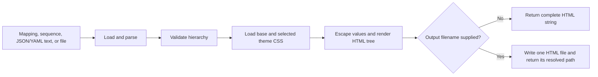

# Hierarchical HTML Renderer

`render_hierarchy_html` turns a mapping or sequence into a responsive, self-contained HTML tree.
It is a direct Python API for plans, reports, outlines, and other nested information. The renderer
is not an MCP tool or CLI command.

The function produces a standalone document. The document embeds its CSS and JavaScript. It
escapes source labels and values and preserves source order. The function can return the complete
document as a string or write it as one UTF-8 HTML file.

## Quick start

```python
from mcp_agent_ops.hierarchy import render_hierarchy_html

plan = {
    "Delivery": {
        "phases": [
            {"title": "Discovery", "status": "complete"},
            {"title": "Implementation", "status": "in_progress"},
        ]
    }
}

html = render_hierarchy_html(
    plan,
    title="Delivery plan",
    theme="outline",
    numbering=True,
    checkboxes=True,
)
```

`html` contains the complete document. To save it instead:

```python
from pathlib import Path

saved_path = render_hierarchy_html(
    Path("plans/delivery.yaml"),
    title="Delivery plan",
    numbering=True,
    output_filename="delivery-plan.html",
    output_folder="reports",
)
```

The destination folder is created when needed, and `saved_path` is the resolved `Path` to the
written file.

## Rendering flow



## Public API

```python
render_hierarchy_html(
    source,
    *,
    title="Hierarchy",
    theme="default",
    themes_folder=None,
    numbering=False,
    checkboxes=False,
    output_filename=None,
    output_folder=None,
)
```

| Parameter | Accepted value | Behavior |
| --- | --- | --- |
| `source` | Mapping, non-string sequence, JSON/YAML text, existing filename string, or `Path` | Supplies the hierarchy. The root must be a mapping or sequence. |
| `title` | `str` | Sets both the browser title and visible page heading. It is HTML-escaped. Default: `Hierarchy`. |
| `theme` | Simple base name | Selects `<theme>.css`. Packaged choices are `default` and `outline`. Default: `default`. |
| `themes_folder` | `str`, `Path`, or `None` | Selects a caller-owned theme folder. Packaged themes are used when omitted. |
| `numbering` | `bool` | Adds one-based dotted numbers such as `1`, `1.2`, and `1.2.1`. Default: `False`. |
| `checkboxes` | `bool` | Adds an initially unchecked tracking checkbox to every node. Default: `False`. |
| `output_filename` | Base filename or `None` | Writes the document when supplied. A directory component is not accepted. |
| `output_folder` | `str`, `Path`, or `None` | Selects or creates the destination folder. Requires `output_filename` and defaults to the current directory. |

The return type depends on `output_filename`:

- Without `output_filename`, the function returns the complete HTML as `str`.
- With `output_filename`, it writes the file and returns its resolved `Path`.

An existing regular output file with the same name is replaced. A symbolic-link output target is
rejected. Use an `.html` filename so browsers and file tools recognize the result correctly.

## Supported hierarchy data

The root must be a mapping or a non-string sequence. Nested values may contain:

- mappings with scalar keys;
- non-string sequences;
- strings, integers, floating-point numbers, booleans, dates, datetimes, or `None`.

Mapping and sequence order are preserved. Values are displayed using JSON-like conventions:
booleans become `true` or `false`, `None` becomes `null`, and dates use ISO formatting.

### In-memory data

```python
render_hierarchy_html(
    {
        "release": {
            "owner": "Delivery",
            "tasks": ["Test", "Publish"],
        }
    }
)
```

### Full JSON or YAML content

```python
render_hierarchy_html('{"release": {"tasks": ["Test", "Publish"]}}')

render_hierarchy_html(
    """release:
  tasks:
    - Test
    - Publish
"""
)
```

Content without an explicit file suffix is attempted as JSON first, then YAML.

### Existing JSON or YAML files

```python
from pathlib import Path

render_hierarchy_html(Path("release.yaml"))
render_hierarchy_html("release.json")  # recognized as a file when it exists
```

Source files must use `.json`, `.yaml`, or `.yml`. Prefer `Path` when a value is intended to be a
filename: a missing `Path` produces a direct `FileNotFoundError`, while a non-existing string is
treated as document content.

## Tree controls

Every generated document begins fully expanded and provides two control groups.

### Branch and global controls

- Selecting a branch row expands or collapses that branch.
- **Expand all** opens every branch.
- **Collapse all** leaves the top-level rows visible and hides all child groups.

### Progressive level controls

The `1`, `2`, `3`, and `All` buttons reveal the hierarchy a layer at a time:

| Control | Visible result |
| --- | --- |
| `1` | Top-level rows only. |
| `2` | Top-level rows and their immediate children. |
| `3` | The first three levels. |
| `All` | Every level. |

**Expand all** selects the same state as `All`; **Collapse all** selects the same state as `1`.
Manually toggling an individual branch clears the active level indicator because the tree no longer
matches a global preset. Trees deeper than level 3 remain accessible through `All` and individual
branch controls.

The generated controls include accessibility metadata:

- Branch buttons expose `aria-expanded` and `aria-controls`.
- The hierarchy uses tree, treeitem, and group roles.
- Level presets expose `aria-pressed` so assistive technology can identify the current state.

## Numbering

With `numbering=False`, mapping nodes use their keys and sequence entries use zero-based synthetic
labels such as `[0]`. With `numbering=True`, every mapping and sequence node receives a one-based
dotted path:

```text
1
1.1
1.1.1
1.1.2
1.2
```

Sequence labels such as `[0]` are omitted in numbered output. Mapping keys remain visible beside
their numbers.

## Tracking checkboxes and persistence

`checkboxes=True` places a native checkbox before every node. The control is intentionally simple:

- it starts unchecked on each page load;
- its state exists only in the current browser DOM;
- it has no save, storage, or source-update handler;
- it does not modify JSON, YAML, Python data, or the generated HTML file.

The public API currently renders documents only; it does not provide an update function. For
durable machine-managed progress, keep JSON or YAML as the source of truth, update that source, and
regenerate the HTML. Do not treat browser checkbox state as authoritative progress data.

## Themes

Packaged themes are:

- `default`: a neutral blue light theme;
- `outline`: a higher-contrast violet light theme.

Both are combined with the packaged responsive base CSS. To use a custom theme, create a CSS file
whose filename matches the `theme` base name:

```text
themes/
└── roadmap.css
```

```python
render_hierarchy_html(
    plan,
    theme="roadmap",
    themes_folder="themes",
)
```

A complete custom theme should define these variables:

```css
:root {
  color-scheme: light;
  --background: #f4f6f8;
  --surface: #ffffff;
  --control: #f8fafc;
  --hover: #eef6ff;
  --text: #26313d;
  --heading: #111827;
  --muted: #64748b;
  --key: #1e3a5f;
  --string: #276749;
  --number: #9c4221;
  --boolean: #6b46c1;
  --accent: #2563eb;
  --branch: #cbd5e1;
  --border: #dbe2ea;
  --border-strong: #c5cfdb;
  --shadow: 0 18px 48px rgb(15 23 42 / 8%);
}
```

Theme names may contain only letters, numbers, hyphens, and underscores, and must begin with a
letter or number. Theme CSS containing a closing `</style` tag is rejected. The renderer embeds
all other custom CSS without sanitizing it, so use only trusted caller-owned theme files. To retain
the self-contained output guarantee, do not use external `@import` rules, fonts, images, or URLs.

## Validation and safety behavior

Before rendering, the function:

- parses files using their suffix and parses inline content as JSON or safe-loaded YAML;
- requires a mapping or sequence root;
- rejects unsupported nested objects and non-scalar mapping keys;
- rejects cyclic in-memory structures;
- HTML-escapes the title, mapping keys, and displayed values;
- confines theme selection to one CSS file inside the selected theme folder;
- requires `output_filename` to be a base filename and rejects symbolic-link targets.

The renderer does not impose an input-size or nesting-depth limit. Callers handling untrusted input
should apply suitable limits before rendering to avoid excessive memory use, output size, or browser
work.

## Errors and troubleshooting

| Error | Likely cause | Resolution |
| --- | --- | --- |
| `FileNotFoundError` for a source | An explicit `Path` does not identify an existing file. | Check the path and use `.json`, `.yaml`, or `.yml`. |
| `FileNotFoundError` for a theme | `<theme>.css` was not found in the packaged or caller-owned theme folder. | Check `theme` and `themes_folder`. |
| `TypeError` for the root | Parsed content is a scalar rather than a mapping or sequence. | Wrap the value in a mapping or sequence. |
| `TypeError` for a nested value or key | The in-memory hierarchy contains an unsupported Python object. | Convert it to a supported scalar, mapping, or sequence. |
| `ValueError` for content | JSON/YAML parsing failed. | Validate the source syntax. |
| `ValueError` for a source suffix | An existing source file does not use `.json`, `.yaml`, or `.yml`. | Rename or convert the source file. |
| `ValueError` for a cycle | An in-memory container refers to itself through its descendants. | Remove or replace the recursive reference. |
| `ValueError` for a theme | The theme is not a safe base name or its CSS closes the generated style block. | Rename or correct the CSS file. |
| `ValueError` for output options | `output_folder` lacks `output_filename`, or the filename includes a directory. | Supply both and keep the directory in `output_folder`. |

## Gallery

The checked-in [hierarchy gallery](../../examples/hierarchy-gallery/README.md) demonstrates:

- a YAML filename with dotted numbering and tracking checkboxes;
- full JSON content with the packaged `outline` theme;
- in-memory Python data with a caller-owned theme.

Generate it from the repository root:

```bash
uv run python examples/hierarchy-gallery/generate_gallery.py
```

The command writes `index.html` and three self-contained examples beneath
`examples/hierarchy-gallery/build/`. Generated gallery output is ignored by Git and can be rebuilt
from the checked-in inputs and generator.

## Implementation and verification

```text
src/
└── mcp_agent_ops/
    └── hierarchy/
        ├── __init__.py                 # Public package export
        ├── renderer.py                 # Parsing, validation, rendering, and output
        └── themes/
            ├── base.css                # Shared responsive and interaction styles
            ├── default.css             # Packaged neutral theme
            └── outline.css             # Packaged outline theme
tests/
├── unit/
│   └── hierarchy/
│       └── test_renderer.py            # API, safety, controls, themes, and output
└── integration/
    └── examples/
        └── test_hierarchy_gallery.py   # Reproducible gallery generation
examples/
└── hierarchy-gallery/
    └── generate_gallery.py             # Runnable examples and gallery index
```

The public behavior is implemented in
[`renderer.py`](../../src/mcp_agent_ops/hierarchy/renderer.py), covered directly by
[`test_renderer.py`](../../tests/unit/hierarchy/test_renderer.py), and exercised end to end by
[`test_hierarchy_gallery.py`](../../tests/integration/examples/test_hierarchy_gallery.py).
